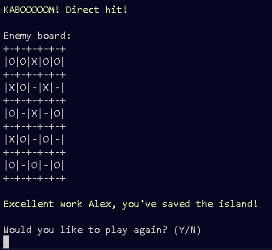
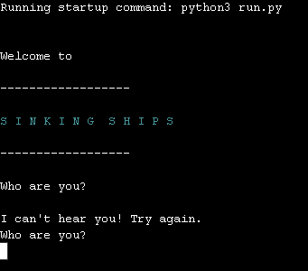

# Sinking Ships!

## Welcome to the fleet!

Sinking ships is a command-line Python3 game of strategy (and more than a bit of luck).

Based primarily on the classic pen-and-paper game Battleships, Sinking Ships takes further inspiration from the eponymous 'Sinking Ships' mini-game in the 2002 video game Legend of Zelda - Wind Waker, where the player must locate and eliminate enemy squid before they have the chance to wreack havoc. The setting of the minigame combined with the mechanism of battleships is what constitutes Sinking Ships - a casual game with a humerous edge for anyone to while away a few minutes on.

**Zee fiends approach!**

---

## **How to play**

1. Run the program from the host site on Heroku.
2. Enter your username when prompted.
3. Choose your map size from small, medium or large - the number of 'ships' at your disposal is notified to the user here.
4. Check over your board, and use the prompt to position your ships by using columns and rows - ships are signified by the string "B" - and see the result of your board when finished.
5. Begin attacking your opponents board by supplying a column and row integer to prompt an attack on the corresponding unit of the board. Misses are marked by a "O", and a hit by an "X"!
6. When all of your opponents squid are sunk, or your own ships, you win or lose!
7. Play again or quit the game.

## **Target users**

The scope of user for a program like this is very wide - it is hopefully a diversionary bit of software for anyone to enjoy, but will most likely be most enjoyed by a user with a background in coding.

## **Features and functions**

- **Username** 

When first running the program, the first function is to record the players username. This function is in place to increase familiarity with the game and for future text prompts to have a personal touch to them, as well as providing the first instance of input validation in the codebase.

After the username is entered, flavor text will describe the "setting" of the game - giving the game a humerous edge and establishing some very minor worldbuilding, as well as providing a reference to millenials such as myself who remember the original game.

- **Map size & board**

There are 3 sizes of map to select, with each increase in size providing more ships to place. This is accomplished by use of the board package (see technologies used), declaring a small, medium and large map as a global variable for both the computer and the user to interact with, and the code to call back to throughout the code structure. The board itself is populated by a anterior function that populates each 'cell' of the board with the tilde ("~") key - this was chosen to represent the sea waves and give a visual pop to the game space, to avoid it feeling to visually empty.

To differentiate between the boards, the computer board is populated by the dash ("-") symbol. This is to help the user know which board is being shown, especially important on the smaller display afforded by the Heroku app.

- **Ship placement**

The next stage in the application is for the user to select the coordinates for their ships. This function is run a set amount of times depending on map size and will populate the board with the ship symbol, which is a "B" string.

Once selected, the user can see the end result of their formation choice. The aim here was for the board to be called immediately to give an optical reminder to the player and keep the flow of information coming.

The application will then populate the computers map with a function that uses Python3's built-in random interger generator to initialise two random numbers, which is then used to populate the computer board. At the same time, there is a dummy board being generated and populated in the same cells, which is used to give a visual for the players attacks without revealing the location of the computers other ships.

- **Attacking & game loop**

The game will then prompt the user for the first attack. The input of the function is identical to the coordination of the defence - ie entering an attack column and row. The game will then interpret the input depending on the fill of the opposition board - if the cell contains a ship, an X symbol will be printed onto the dummy board which is then displayed to the player. 

Concurrently the computer attack function will check for a hit on the player board, again utilising the randrange function to pull integers within the boards bounds and enter them into the function, which then checks the cell population.

Misses are displayed on the board as a O symbol. This is a point of differentiation so the player can determine the state of their board and from there be able to make an informed decision on where to attack next.

When the game is completed, the player will be presented with an option to either break the game loop and leave the application or play again, starting the main play game function again and beggining another play loop.

## **Methodology**

The first step of development of this project was to map out the functions that I believed would be needed to create a game with the scope detailed by the project outline.

With that in mind, the decision was taken early on to utilise the board package to simplify the process of designing the maps, and to provide them with a visual fidelity that I though would work well for the user.

To that end, the boards are declared at the top of the code as global variables to be passed around through multiple functions. Three sets of three were needed for the user, opponent, and a visual dummy board to give ocular feedback to the user for hits or misses.

The functions are then roughly divided into initial user input and game loop, with initial user input for username & placement of ships, and game loop handling the attacking of the computer board.

Most of the paremeters for the game loop are declared in the main function and then passed into the main game loop - including map size, max column and row size, , arrays managing occupied cells/attempts and the win threshold.

When creating this project, the primary focus in my initial development time was to make sure that the innate functionality of all its constituent parts operate in a satisfactory manner. In the process of doing so, in its earliest incarnations, there was a lot of repeated code across the three map sizes that needed to be condensed. Whilst I am satisfied that the lions share of the project is laid out in a readable manner, there are sections that remain that I believe could have been better incorperated with more development time.

## **Future features**

- **Colored boards**

(See bugs) One of the problems encountered in creation of the game is the dovetail between the package generating the board and the one generating color for the characters in the command line didn't gel, and provided boards with a lot of ascii errors. Future releases of the game would hopefully rectify this and have the board be more visually appealing to the user.

- **Ship variants**

Further versions of the game will give the user an ability to have an array of multi-celled ships rather than just the single string. This makes the game more interesting and tactical, and dampen the role of luck in a win or a loss. This feature was a casualty of time constraints during development.

- **Diagonal positioning**

Following on from ship variants, the multi-celled ships will have the ability to be placed diagonally and not just on a x or y-axis.

- **Wider board**

In providing the option for multiple board sizes, the game naturally incurs a lot of scrolling. In future releases the project would look to have the boards expand out horizontally to alleviate this aspect.

## **Testing**

### **Validation**

**Username validation**

User cannot leave input prompt empty.

**Map size validation**

User can only enter S/s/M/m/L/l.

**Player coordination validation**

User cannot enter integers out of bounds, invalid characters or leave blank.

**Player attack validation**

User cannot enter integers out of bounds, invalid characters, leave blank or repeat attack coordinates. 

**Restart game validation**

User can only enter Y/y/N/n.

### **PEP8 (Pycodestyle)**

No major issues presented using PEP8/Pycodestyle.

## **Technology and additional software used**
- Python3
    - [random](https://docs.python.org/3/library/random.html)
        - Random.randrange function used to generate random coordinates for placement of enemy ships on computer board, and attack coordinates on the player's board.
    - [board](https://pypi.org/project/board/#description)
        - Used to implement a general board structure in order to somplify the actual process of generating a game space.
    - [colorama](https://pypi.org/project/colorama/)
        - Fore aspect of Colorama used to provide a pop of color to increase visual enjoyment for the user.
    - [PEP8 (aka pycodestyle)](https://peps.python.org/pep-0008/)
        - Main linter used to list any abnormalities in code structure and layout.
        
## **Bugs**

### **Development**

- When starting the initialisation process for the game boards, the original idea was to have them populated by colored icons using the colorama package. However when using the syntax utilised elsewhere in the project for one-off color bursts;

    (Fore.BLUE + "~" + Style.RESET_ALL)

    The board would throw up a lot of character errors;

- In the player coordinate function, there is a subroutine to add the columns and rows selected to a set that is initialised in the main game function. However, when applying the same logic to the computer coordinates (to stop it from generating the same sets and populating the board over itself) the syntax used was causing the randrange element of the function to return the same numbers every time (1, 1)
This was because I had included the check of the set in the population check section of the code, causing the generation to return the same numbers. Reworking the function to simplify the check fixed the error and allowed the generator to start returning random integers again;

                    row = randrange(0, 7)
                    col = randrange(0, 7)
                    if ((row, col)) in c_occupied:
                        comp_coords(comp_map, csmall, cmed, clarge, c_occupied)
                    else:
                        csmall.populate(ships, csmall.iterline((row, col), (1, 0)))
                    c_occupied.add((row, col))

### **Unfixed Bugs**

CONDENSE

## **Deployment**

Application was created in Gitpod Code IDE and hosted on [Heroku](https://sinking-ships-ec79824176fc.herokuapp.com/).
The process for deployment is listed below;

1. Generate dependencies to the requirements.txt file in the IDE by running **pip3 freeze > requirements.txt**.
2. Log into Heroku and click **create new app**.
3. Name the app and fill in required information.
4. On the app dashboard, click on settings and go to **Config Vars**.
5. Add key -> **PORT** and value -> **8000**.
6. In the same page, add the **Python and NodeJS** buildpacks (in that order).
7. Click on deploy and then **deployment method -> GitHub**.
8. Connect to GitHub and **link to project name(Sinking Ships)**.
9. Click deploy -> main branch from **manual deployment** section.
10. Once successfully deployed, click **view app**.

## **Credits**

- As always many thanks to my mentor Dick Vlandaaren for the patience, and words of wisdom. This project was difficult for me to get my head around, but the advice was always excellent, if not my ability to follow through on it.
- Inspiration taken from Sinking Ships in the [Legend of Zelda : The Wind Waker](https://www.zeldadungeon.net/wiki/Sinking_Ships). 
- Research and structural inspiration from similar projects from [Stack Overflow](https://stackoverflow.com/questions/77575338/battleship-project-with-python) and [Code Academy](https://discuss.codecademy.com/t/excellent-battleship-game-written-in-python/430605)

